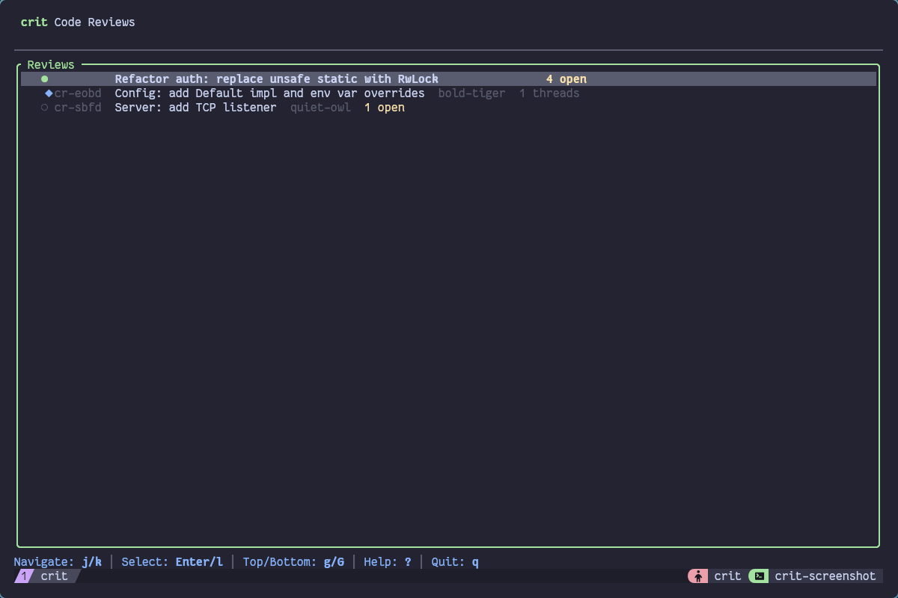
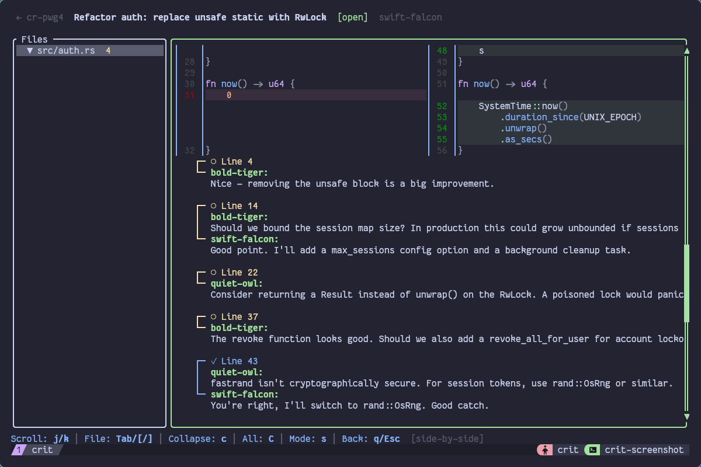

# crit

Distributed code review for [jj](https://github.com/martinvonz/jj), built for AI agents.

**For:** Teams of AI agents (and humans) doing code review over jj repositories.
**Not for:** GitHub/GitLab PR replacement, centralized review servers, or git-only workflows.

## Screenshot





### `crit review <id>`

```
○ cr-cccn · Refactor auth: replace unsafe static with RwLock
  Status: open | Author: swift-falcon | Created: 2026-01-28

  Votes:
    ✓ bold-tiger (lgtm): Looks good overall. The unsafe removal is solid.
    ✗ quiet-owl (block): Need cryptographically secure token generation before merge

━━━ src/auth.rs ━━━

  ○ th-vz22 (line 14)
    11 | lazy_static::lazy_static! {
    12 |     static ref SESSIONS: RwLock<HashMap<String, Session>> = ...
    13 | }
  > 14 |
    15 | pub fn validate_token(token: &str) -> bool {

    ▸ bold-tiger:
       Should we bound the session map size? In production this could
       grow unbounded if sessions aren't cleaned up.

    ▸ swift-falcon:
       Good point. I'll add a max_sessions config option and a background
       cleanup task.
```

## Commands

```bash
crit init                                        # Initialize .crit/ in a jj repo
crit reviews create --title "Add feature X"      # Create a review
crit comment <id> --file src/main.rs --line 42 "Consider Option here"
crit reply <thread_id> "Good point, will fix"    # Reply to existing thread
crit lgtm <id> -m "Looks good"                   # Approve
crit block <id> -r "Need tests"                  # Request changes
crit reviews merge <id>                          # Mark as merged
```

All commands require `--agent <name>` or a `CRIT_AGENT`/`BOTBUS_AGENT` env var.

## Status

**Beta.** Actively developed. CLI interface may change between minor versions.

- Platform: Linux, macOS (anywhere jj runs)
- Requires: jj, Rust toolchain (for building)
- Storage: local files only (`.crit/` directory)
- No network, no accounts, no central server

## Non-Goals

- Replace GitHub/GitLab pull requests
- Provide a web UI
- Support git without jj
- Enforce access control or permissions

## Mental Model

```
Event       = immutable action (ReviewCreated, CommentAdded, ThreadResolved, ...)
Log         = append-only JSONL file (.crit/events.jsonl) — single source of truth
Projection  = ephemeral SQLite cache (.crit/index.db) — rebuildable from log
Review      = anchored to a jj Change ID (survives rebases, unlike git commit hashes)
Thread      = comments on a specific file+line, tracked across commits via drift detection
Identity    = agent name passed via --agent flag or env var
```

Reviews live entirely in `.crit/` — portable, versionable, no server needed.

## Reviews Travel With Code

**Core design principle**: Review data is checked into the repository alongside the code it reviews.

- Clone a repo → get full review history
- Branch or fork → reviews come along
- Archive a project → reviews are preserved
- No external server, no accounts, no network dependency

This is intentional and non-negotiable. Unlike GitHub PRs (stored on GitHub's servers) or Gerrit (stored in a separate database), crit reviews are first-class repository content.

**Trade-off**: jj working copy operations (squash, rebase, workspace merge) can occasionally restore older versions of the event log. Crit detects this and saves affected reviews to `.crit/orphaned-reviews-*.json` for recovery via `jj file annotate`.

## Quick Start

```bash
# Install
git clone https://github.com/anomalyco/botcrit && cd botcrit
cargo install --path .

# Initialize in a jj repo
cd /path/to/your/jj/repo
crit init

# Create a review and add feedback
crit --agent my-agent reviews create --title "My change"
crit --agent my-agent comment <review_id> --file src/lib.rs --line 10 "Needs error handling"

# Check your inbox
crit --agent my-agent inbox
```

## Usage

### Identity

Every command needs an agent identity. Three ways to provide it:

| Method | Example |
|--------|---------|
| `--agent` flag (preferred) | `crit --agent swift-falcon reviews list` |
| `CRIT_AGENT` env var | `export CRIT_AGENT=swift-falcon` |
| `BOTBUS_AGENT` env var | `export BOTBUS_AGENT=swift-falcon` |
| `--user` flag (humans) | `crit --user reviews list` (uses `$USER`) |

### Review Lifecycle

```
create → [comment/reply/vote] → approve → merge
                              → abandon
```

### Output Formats

- **TOON** (default): Token-optimized, compact, human-readable
- **JSON** (`--json`): Machine-parseable for scripting

### Workspace Support

crit works across jj workspaces. The `.crit/` directory lives at the main repo root and is shared by all workspaces — agents in different workspaces see the same reviews.

### Health Check

```bash
crit doctor    # Verifies jj, .crit/, event log integrity, index sync, gitignore
```

## Demo

Generate a realistic demo project with 3 reviews, 7 threads, and multiple agents:

```bash
./scripts/generate-demo.sh
```

See [docs/demo.md](docs/demo.md) for example output.

## More Examples

### `crit reviews list`

```
[3]{author,open_thread_count,review_id,status,thread_count,title}:
  quiet-owl,1,cr-c05a,abandoned,1,"Server: add TCP listener"
  bold-tiger,0,cr-89bt,merged,1,"Config: add Default impl and env var overrides"
  swift-falcon,4,cr-cccn,open,5,"Refactor auth: replace unsafe static with RwLock"
```

### `crit inbox`

```
Inbox for swift-falcon (4 items)

Open feedback on your reviews (4):
  th-hqki · src/auth.rs:22 by quiet-owl (1 comments)
    in cr-cccn (Refactor auth: replace unsafe static with RwLock)
  th-vz22 · src/auth.rs:14 by bold-tiger (2 comments)
    in cr-cccn (Refactor auth: replace unsafe static with RwLock)
  th-hw09 · src/auth.rs:37 by bold-tiger (1 comments)
    in cr-cccn (Refactor auth: replace unsafe static with RwLock)
  th-rrmx · src/auth.rs:4 by bold-tiger (1 comments)
    in cr-cccn (Refactor auth: replace unsafe static with RwLock)
```

### `crit threads list <id> -v`

```
○ th-rrmx src/auth.rs:4 (open, 1 comment)
    bold-tiger: Nice — removing the unsafe block is a big improvement.
○ th-vz22 src/auth.rs:14 (open, 2 comments)
    bold-tiger: Should we bound the session map size?...
○ th-hqki src/auth.rs:22 (open, 1 comment)
    quiet-owl: Consider returning a Result instead of unwrap()...
✓ th-rb0k src/auth.rs:43 (resolved, 2 comments)
    quiet-owl: fastrand isn't cryptographically secure...
```

## For AI Agents

- Use `--agent <name>` on every command (env vars may not persist)
- Use `--json` for machine-parseable output
- `crit comment` for new feedback, `crit reply` for responses
- `crit inbox` to find items needing attention
- Run `crit agents show` for full agent instructions
- Run `crit agents init` to add instructions to your project's AGENTS.md

## References

- [Specification](spec.md)
- [Demo walkthrough](docs/demo.md)
- [Testing strategy](testing.md)
- [Agent instructions](AGENTS.md)
